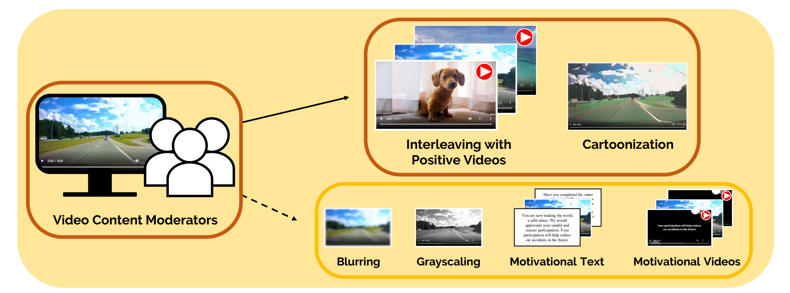

I’m in the 1st year of Ph.D. program in Department of Computer Science and Engineering at POSTECH. I work with <a href="https://https://eunkyungjo.com" class="highlight_info" target="_blank">Prof. Eunkyung Jo</a> at Health and Human-Computer Interaction (H2CI) Lab, POSTECH.

I aim to support human well-being and learning in real-world contexts by bridging the gap between social computing and educational technology. My research focuses on designing interactive systems that foster collaborative synergy in both human-human and human-machine interactions, ultimately personalizing experiences and empowering users in their daily lives. 
## News

Feb 2026 Joined the H2CI Lab @POSTECH as a Ph.D. student 

Feb 2026 Successfully defended my Master's thesis and graduated from DGIST 

Sep 2025 Submitted my first first-author full paper to CHI 

Apr 2025 Attending CHI 2025 virtually 

Feb 2025 Attending HCI Korea 2025 

Jul 2024 Attending DIS 2024 in Copenhagen, Denmark! 

Jul 2024 Our paper (2nd author) has been accepted to DIS 2024! 

Dec 2023 Attending KSC 2023 in Busan /p>

Oct 2023 Served as the Organizing Chair for the "Happy Hour & Student Conference" @EECS, DGIST 

Feb 2023 Attending HCI Korea 2023 

Sep 2023 Joined the DIAG Group @DGIST 

## International Conference Papers

  

    

      
      

        <i class="fa-solid fa-magnifying-glass-plus"></i>
      

    

  

  

    
<strong>Exploring Intervention Techniques to Alleviate Negative Emotions during Video Content Moderation Tasks as a Worker-centered Task Design</strong>

    
Dokyun Lee, Sangeun Seo, Chanwoo Park, Sunjun Kim, Buru Chang, and Jean Y Song

    

      ACM DIS 2024
      
        <a href="assets/img/DIS2024.pdf" class="paper-link" target="_blank">PDF</a>
        <a href="https://dl.acm.org/doi/10.1145/3643834.3660708" class="paper-link" target="_blank">DOI</a>
      
    

  

## Domestic Conference Papers

  

    
<strong>크라우드 워커의 심리적 보호와 작업 지속성을 위한 개입 기술 탐색</strong>

    
Dokyun Lee, Sangeun Seo, and Jean Y. Song

    
HCI Korea 2025
    
        <a href="https://dokyunlee.github.io/assets/materials/HCI_korea_paper_2025.pdf" class="paper-link" target="_blank">PDF</a>
      
    

  

